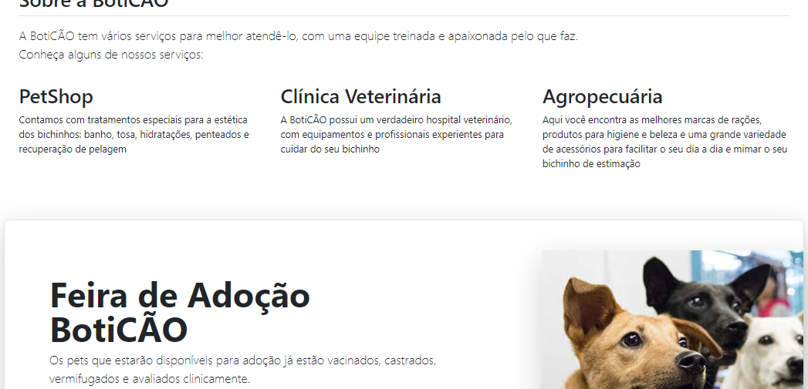

   

  

  &#xa0;

<h1 align="center">Hotsite da feira de adoção</h1>

  

  

  

 

## :dart: About ##

Esse repositório contém os arquivos do exercício da aula de HTML: um hotsite para divulgação de uma feira de adoção de animais.\
OBS.: Todos os dados são fictícios e foram usados apenas para fins didáticos.

## :rocket: Technologies ##

The following tools were used in this project:

- [bootstrap](https://getbootstrap.com/)

&#xa0;

## Autores

- [@rss-ptk](https://www.github.com/rss-ptk)

&#xa0;
<a href="#top">Back to top</a>
